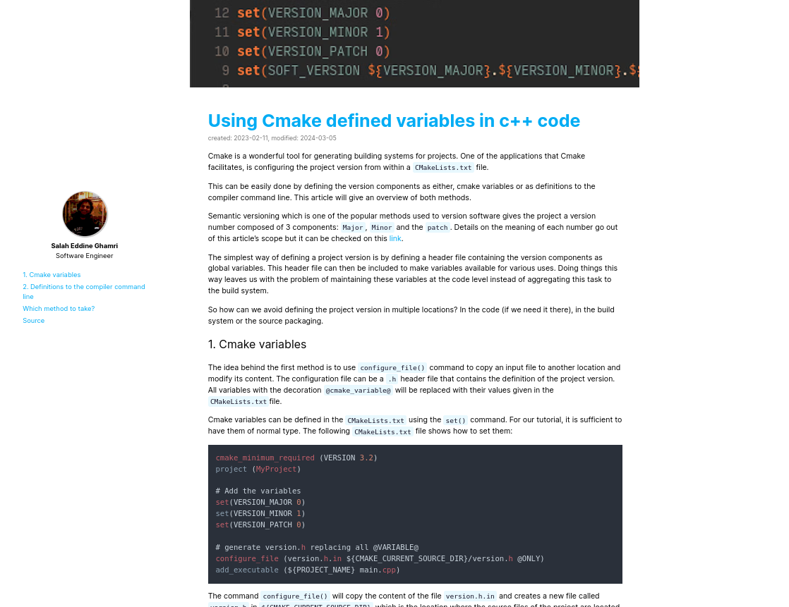

A theme i use for zola static website generator.
check out my blog using this theme: [My webpage](https://salaheddineghamri.github.io/)



### Thanks to
* This theme is based on another theme called "even" but modified.
* Some parts like callouts were copied from here:
    - https://github.com/isunjn/serene

### How to add a blog post ??
* just run:
    ```zola serve ```
* add the blog post .md in the content
* start adding content

### Main features:
* support for mathematical equations.
* callouts for note and warning and equations ...
* support of arabic language "rtl" direction (some issues still)

### RoadMap
* toggle dark theme
* make it suitable for arabic language
* little enhancements and aesthetics
